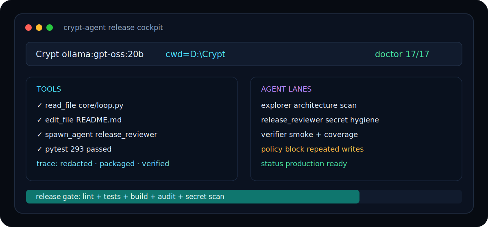

# 🧠 Crypt


Crypt is a local-first coding agent harness for serious software work. It keeps
the runtime small enough to understand, but includes the pieces a production
agent needs: typed tools, live terminal state, safe writes, subagents, target
evals, trace redaction, and installable packaging.

## Repo Role

This repository is the product UI-agent shell: Electron desktop, visual
surfaces, preview workflows, design tools, packaged app assets, and Agent D style
product experience.

The sibling `CryptCore` repository is the CLI/core source of truth. Crypt should
consume CryptCore through `python -m crypt`, `python -m crypt app-daemon`, a
local development package path, or a future formal app-server protocol. Runtime
policy, providers, tool behavior, sessions, memory, approvals, and safety should
land in CryptCore first.

See [Crypt UI-Agent Boundary](docs/CRYPT_UI_AGENT_BOUNDARY.md).



## ✨ Why Crypt

- 🧩 **Simple core:** one CLI entrypoint, modular `core/` services, and one tool per file in `tools/`.
- 🔐 **Safer by default:** read-before-edit, stale-write protection, shell danger checks, secret redaction, and SSRF-safe `web_fetch`.
- 🤖 **Multi-provider:** Anthropic, OpenAI-compatible endpoints, ChatGPT/Codex OAuth, Gemini, and Ollama.
- 🧠 **Subagents:** typed explorer, planner, worker, verifier, UI reviewer, and release reviewer lanes.
- 📊 **Measurable quality:** benchmark tasks, real-repo target evals, traces, CI, coverage, wheel smoke tests, and dependency audit.
- 🧰 **Fork friendly:** focused docs, explicit module boundaries, and a release checklist for contributors.

## 🚀 Quick Start

```bash
python -m pip install -e ".[dev]"
python -m crypt doctor
python -m crypt bench --bench-list
python -m crypt
```

Fresh clones default to local Ollama in the current directory. Start Ollama with
`ollama serve`, or run `python -m crypt setup` to save another provider, model,
or workspace.

## Desktop App

The Electron app is a desktop shell over the same Python backend as the CLI/TUI.
Provider auth, tools, workspace state, task routing, thinking modes, and
subagents all flow through `python -m crypt app-daemon`.

Desktop tabs:

- `Chat` keeps the main conversation quiet and fast.
- `Agents` shows active runs, model routes, tool calls, thinking, and subagent lanes.
- `Code` pairs the chat stream with a preview browser for localhost apps or HTML/SVG files.
- `Design` adds prompt-to-artifact controls for surface, visual direction, and target frame, then previews the generated files beside the design stream.

Local HTML/SVG previews are served through Electron's `crypt-preview://`
protocol. The protocol only serves files inside the active workspace or files
chosen explicitly through the preview picker, so generated pages can load local
assets without opening arbitrary paths on disk.

```bash
python -m pip install -e ".[dev]"
npm --prefix desktop ci
npm --prefix desktop run electron:preview
```

For live renderer development, use:

```bash
npm --prefix desktop run electron:dev
```

Use `electron:preview` when testing release behavior because it builds
`desktop/renderer/dist` first, then launches Electron from the static assets.
If the backend does not start, run `python -m crypt doctor` and confirm the
same provider works in `python -m crypt`.

## ⚡ Daily Commands

| Command | Purpose |
|---|---|
| `python -m crypt` | Launch the interactive agent |
| `npm --prefix desktop run electron:dev` | Launch the Electron desktop app |
| `npm --prefix desktop run electron:preview` | Build and launch the Electron app from static assets |
| `python -m crypt setup` | Save provider, model, and workspace defaults |
| `python -m crypt doctor` | Validate local runtime health |
| `python -m crypt bench --bench-list` | List benchmark tasks |
| `python -m crypt eval-target --cwd D:\repo --eval-check "pytest -q"` | Run a real-repo target eval |
| `python -m pytest` | Run the test suite |
| `python -m ruff check .` | Lint the repo |
| `python -m build` | Build source and wheel packages |

## 🗺️ Repo Map

```text
main.py              CLI startup, setup, provider selection
crypt/               `python -m crypt` package shim
core/                agent loop, providers, safety, sessions, evals, UI
core/agents/         typed subagent registry and task lifecycle
core/ui_kit/         terminal UI components and rendering primitives
tools/               model-visible tools, one module per tool
benchmarks/          packaged benchmark suites
tests/               focused regression and production-runtime coverage
docs/                architecture and operating reference
desktop/             Electron desktop shell and React renderer
```

## 🛡️ Production Guardrails

Crypt ships with guardrails that are tested in CI:

- secrets are redacted before transcript, trace, shell-spill, and background-log writes
- destructive shell commands stay approval-gated even when auto-work runs ordinary shell, web, and file-open tools
- repeated blind writes are blocked before they turn into tool loops
- worker subagents can only write inside assigned scopes
- local HTML/SVG previews are scoped through `crypt-preview://` so generated pages can load workspace assets without arbitrary disk access
- package builds are installed and smoke-tested from a clean temp directory

## 📚 Docs

- [Architecture](docs/ARCHITECTURE.md)
- [Reference](docs/REFERENCE.md)
- [Contributing](CONTRIBUTING.md)
- [Security](SECURITY.md)

## ✅ Release Check

Run this before publishing or pushing a release branch:

```bash
python -m ruff check .
python -m compileall -q main.py benchmarks core tools crypt tests
python -m crypt doctor
python -m pytest --cov=core --cov=tools --cov-report=term-missing --cov-fail-under=60
python -m build
python -m pip_audit -r requirements.txt
```

Crypt is production-oriented, not magic. Treat every final claim as something
that should be backed by a test, a trace, a verifier result, or a concrete diff.
