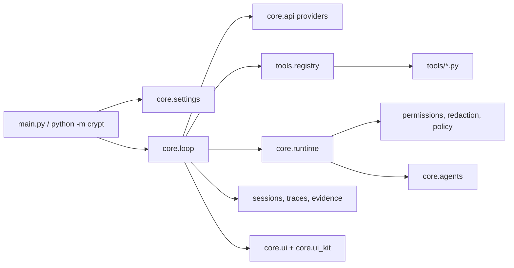

# Architecture

Repo role: Crypt is the product UI-agent shell. CryptCore is the CLI/core source
of truth for runtime policy, provider routing, tools, sessions, memory,
approvals, and verification. This repository may contain a transitional Python
core copy, but the target architecture is for the desktop/UI product to consume
CryptCore through the CLI, daemon, package, or formal protocol boundary.

Crypt is intentionally flat: the CLI starts the runtime, `core/` owns durable
behavior, and `tools/` exposes narrow model-visible actions.

## Module Boundaries

| Area | Owns | Should not own |
|---|---|---|
| `main.py` | argument parsing, setup, provider selection | tool behavior or model policy |
| `core/loop.py` | think-act-observe loop and turn orchestration | per-tool business logic |
| `core/api.py` | provider adapters and streaming contracts | local filesystem mutation |
| `core/runtime.py` | session-scoped context shared with tools | persisted user config |
| `core/permissions.py` | allow/deny and danger classification | tool schema validation |
| `core/redact.py` | best-effort secret scrubbing | provider-specific auth lookup |
| `core/tool_policy.py` | cross-tool write-loop and worker-scope checks | file edit mechanics |
| `core/agents/` | typed subagent registry, task state, worktree diffs | parent-loop provider setup |
| `core/ui.py` | public terminal UI facade | raw styling primitives |
| `core/ui_kit/` | reusable terminal components | model/runtime decisions |
| `tools/` | one model-visible tool per file | global orchestration policy |

## Turn Lifecycle

1. The CLI resolves provider, model, approval mode, and workspace.
2. `core.loop` builds the system prompt and sends the current message array.
3. Provider adapters stream text, reasoning, and tool-use blocks.
4. The tool registry validates schemas, permissions, subagent scope, and policy.
5. Tool results are redacted, traced, recorded as evidence, and appended.
6. The loop continues until the assistant returns a final answer.

## Tool Lifecycle

Tool modules expose a schema, a summary, optional preflight/classification, and
an execution function. Shared invariants live outside individual tools:

- `tools.registry` handles schema validation and dispatch.
- `core.permissions` handles user approval and danger checks.
- `core.tool_policy` handles repeated writes and subagent write scopes.
- `core.file_state` handles read-before-edit and stale reads.
- `core.redact` scrubs sensitive output before it reaches durable storage.

## Subagents

Subagents are typed runtime lanes, not independent products:

| Type | Access | Purpose |
|---|---|---|
| `explorer` | read-only | codebase investigation |
| `planner` | read-only | implementation planning |
| `worker` | scoped write | bounded implementation |
| `verifier` | read-only | adversarial verification |
| `ui_reviewer` | read-only | terminal UI review |
| `release_reviewer` | read-only | release readiness review |

Workers must receive explicit `write_paths`. Isolated worktrees are rejected
when the main tree is dirty so agents cannot accidentally miss uncommitted work.

## Safety Model

Crypt treats model output as untrusted until checked. The production safety path
is layered:

- schemas reject malformed tool calls
- permission rules classify risky shell commands
- write tools require fresh reads for existing files
- generated artifacts and active file formats require explicit handling
- web fetches reject private and rebinding targets
- transcripts, traces, background logs, and shell spill files are redacted

## Release Gates

CI runs across Windows, Ubuntu, and macOS with Python 3.13:

- dependency install and `pip check`
- `pip-audit` against runtime requirements
- `ruff check .`
- compile/import/CLI smoke checks
- deterministic benchmark and target-eval smoke tests
- coverage-gated test suite
- wheel build plus installed-wheel CLI and benchmark smoke checks
